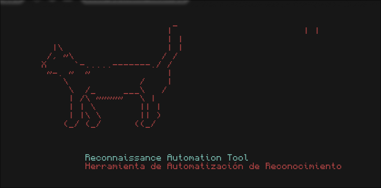
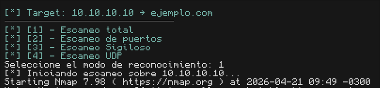

# reconwrapper
> Reconnaissance Automation Tool for penetration testing

`reconwrapper` es una herramienta de línea de comandos que automatiza la fase de reconocimiento en pentesting. Permite agregar targets al `/etc/hosts` y lanzar distintos tipos de escaneos con `nmap` desde un menú interactivo.

---

## 📋 Requisitos

- Python 3.10+
- `nmap` instalado
- `colorama` (`sudo pacman -S python-colorama`)
- Ejecutar como **root**

---

## 🚀 Uso

```bash
sudo python main.py
```

El flujo es el siguiente:

1. Indicar si la IP ya está en `/etc/hosts` o ingresarla manualmente
2. Ingresar el dominio correspondiente
3. Seleccionar el modo de escaneo desde el menú
4. Repetir o salir al finalizar

### Modos de escaneo disponibles

| # | Modo | Flags |
|---|------|-------|
| 1 | Escaneo total | `-sV -sC -p-` |
| 2 | Escaneo de puertos | `-sV -sC --top-ports 1000` |
| 3 | Escaneo sigiloso | `-sS -p-` |
| 4 | Escaneo UDP | `-sU --top-ports 200` |

Los resultados se exportan automáticamente en formato `.txt` en el directorio actual.

---

## 📸 Screenshots




---

## 📁 Estructura

```
reconwrapper/
├── main.py       # Orquesta el flujo principal
├── hosts.py      # Manejo del /etc/hosts
├── scanner.py    # Módulos de escaneo con nmap
└── utils.py      # Validaciones, colores y helpers
```

---

## ⚠️ Disclaimer

Esta herramienta es para uso exclusivo en entornos controlados y con autorización explícita. El uso no autorizado contra sistemas ajenos es ilegal.
